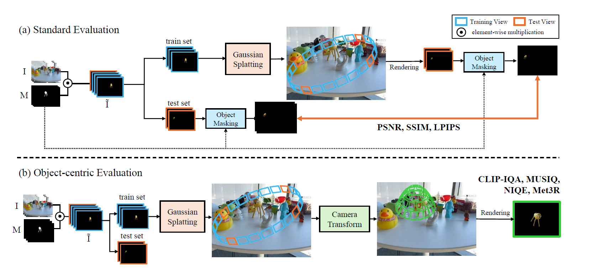

# Reconstructing Objects, Not Scenes: Stable Object-centric 3D Gaussian Splatting under Multi-view Inconsistent Supervision


## Environmental Setup


### 1. Clone the Repository

```bash
git clone https://github.com/kgh1234/SOC-GS-Reconstructing-Objects-Not-Scenes --recursive
```


### 2. Environment Configuration

For convenience, we provide a pre-built Docker environment!

``` bash
docker pull mobuk/socgs:latest
```

This Docker image does not include the source code.
Please use the mount option to link the cloned GitHub repository.

``` bash
docker run -it -v {PWD}:/workspace --gpus all --shm-size=16g --name socgs mobuk/socgs:latest /bin/bash
```


### 3. Prepare FOCUS Dataset

Our benchmark is composed of these four datasets. The original source can be downloaded as follows:

- MipNeRF360 : https://jonbarron.info/mipnerf360/
- LERF-Mask : https://github.com/lkeab/gaussian-grouping/blob/main/docs/dataset.md
- DTU datasets : https://roboimagedata.compute.dtu.dk/
- Tanks and Temples : https://www.tanksandtemples.org/

In accordance with the license terms, we are distributing the mask annotations for **lerf-mask**. Please download them using the link below.

- LERF-Mask : Coming Soon

If the link does not work, please contact now0104@knu.ac.kr .


*** For other datasets, mask annotations were generated by referring to the contents of [`FOCUS_dataset/FOCUS_Dataset.md`](FOCUS_dataset/FOCUS_Dataset.md). 


After downloading, organize the datasets as follows:

```
SOC-GS
data
├── lerf_mask
│   ├── figurines_15
│   │   ├── images
│   │   ├── mask
│   │   ├── sparse
│   │   
│   ├── figurines_33
│   ├── ...
│
├── mipnerf
│   ├── bicycle
│   ├── ...
│
├── tanks_temples
│   ├── Barn
│   ├── ...
│
├── dtu
│   ├── scan02
│   ├── ...
│
...

```


## End-to-end running

Run the script from the following directory:
``` bash
# LERF-Mask
bash script/train_lerfmask.sh

# MipNeRF 360
bash script/train_mipnerf.sh

# Tanks and Temples
bash script/train_tnt.sh

# DTU dataset
bash script/train_dtu.sh
```


## Hyperparameters

### SOC-GS Module Control

| Argument | Default | Description |
|---|---|---|
| `--geometric_filtering` | `True` | Enable/disable geometric view consistency filtering |
| `--region_filtering` | `True` | Enable/disable region-based view validation |
| `--gaussian_merge` | `True` | Enable/disable Gaussian merging |
| `--prune_ratio` | `1.0` | Pruning ratio. Set to `0.0` to disable pruning |

### View Filtering

| Argument | Default | Description |
|---|---|---|
| `--cov_threshold` | `0.2` | Co-visibility score threshold for geometric view filtering. Lower values apply more conservative filtering |
| `--hit_ratio` | `0.05` | Hit ratio threshold for region-based view validation. Views below this value are excluded from training |

### Pruning

| Argument | Default | Description |
|---|---|---|
| `--prune_iterations` | `600 1200 1800` | Iterations at which mask-guided pruning is performed |
| `--threshold_prune_k` | `0.5` | Distribution coefficient for adaptive pruning threshold (τ = µ + kσ). Higher values prune more aggressively |
| `--pruning_max` | `0.05` | Upper bound of the mask overlap pruning threshold |

### Gaussian Merging

| Argument | Default | Description |
|---|---|---|
| `--step` | `1000` | Interval (in iterations) at which Gaussian merging is performed |
| `--end` | `15000` | Iteration at which Gaussian merging stops |

### Mask

| Argument | Default | Description |
|---|---|---|
| `--mask_dir` | `""` | Path to the object mask directory |
| `--mask_binary_threshold` | `128` | Binarization threshold for masks (0–255) |
| `--mask_invert` | `False` | Invert the mask |
| `--mask_disabled` | `False` | Disable mask entirely |

### Training

| Argument | Default | Description |
|---|---|---|
| `--iterations` | `30000` | Total number of training iterations |
| `--test_iterations` | `7000 30000` | Iterations at which test evaluation is performed |
| `--save_iterations` | `7000 30000` | Iterations at which the model is saved |
| `--checkpoint_iterations` | `[]` | Iterations at which checkpoints are saved |
| `--start_checkpoint` | `None` | Path to checkpoint to resume training from |
| `--white_background` | `False` | Use white background |
| `--disable_viewer` | `False` | Disable the GUI viewer |


## Object-centric evaluation



```
bash script/object_centric_eval
```


