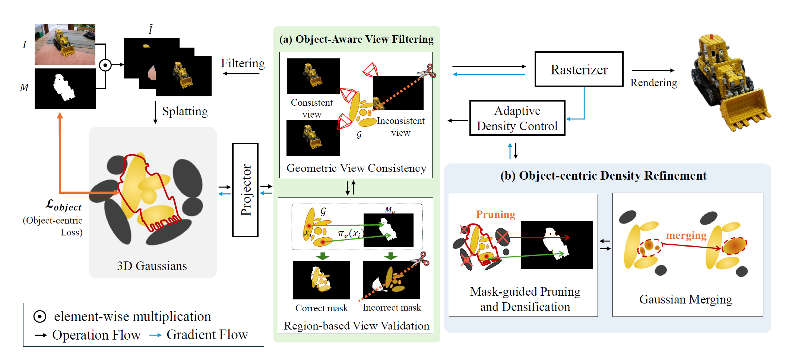

# Reconstructing Objects, Not Scenes: Stable Object-centric 3D Gaussian Splatting under Multi-view Inconsistent Supervision




## Environmental Setup


### 1. Clone the Repository

```bash
git clone https://github.com/kgh1234/SOC-GS-Reconstructing-Objects-Not-Scenes --recursive
```


### 2. Environment Configuration

For convenience, we provide a pre-built Docker environment!

``` bash
docker pull mobuk/socgs:latest
```

This Docker image does not include the source code.
Please use the mount option to link the cloned GitHub repository.

``` bash
docker run -it -v {PWD}:/workspace --gpus all --shm-size=16g --name socgs mobuk/socgs:latest /bin/bash
```


### 3. Prepare FOCUS Dataset

Our benchmark is composed of these four datasets. The original source can be downloaded as follows:

- MipNeRF360 : https://jonbarron.info/mipnerf360/
- LERF-Mask : https://github.com/lkeab/gaussian-grouping/blob/main/docs/dataset.md
- DTU datasets : https://roboimagedata.compute.dtu.dk/
- Tanks and Temples : https://www.tanksandtemples.org/

In accordance with the license terms, we are distributing the mask annotations for **lerf-mask**. Please download them using the link below.

- LERF-Mask : Coming Soon

If the link does not work, please contact now0104@knu.ac.kr .


*** For other datasets, mask annotations were generated by referring to the contents of [`FOCUS_Dataset/FOCUS_Dataset.md`](FOCUS_Dataset/FOCUS_Dataset.md). 


After downloading, organize the datasets as follows:

```
SOC-GS
data
├── lerf_mask
│   ├── figurines_15
│   │   ├── images
│   │   ├── mask
│   │   ├── sparse
│   │   
│   ├── figurines_33
│   ├── ...
│
├── mipnerf
│   ├── bicycle
│   ├── ...
│
├── tanks_temples
│   ├── Barn
│   ├── ...
│
├── dtu
│   ├── scan02
│   ├── ...
│
...

```


### 4. Run

Run the script from the following directory:
``` bash
# LERF-Mask
bash script/train_lerfmask.sh

# MipNeRF 360
bash script/train_mipnerf.sh

# Tanks and Temples
bash script/train_tnt.sh

# DTU dataset
bash script/train_dtu.sh
```


